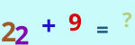

# Math_Captcha

## Example




## Features

- [x] 用 rust 编写的数学验证码生成库

## Install

```bash
cargo add math_captcha
```

## Usage

```rust
use math_captcha::Captcha;

fn main() {
    let a = Captcha::new(150, 50); // width: 150, height: 50
    println!("value:{},base64_img:{}", a.value, a.base64_img);
}
```
